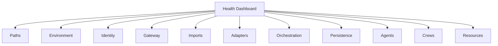
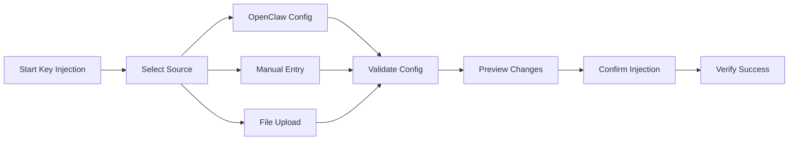
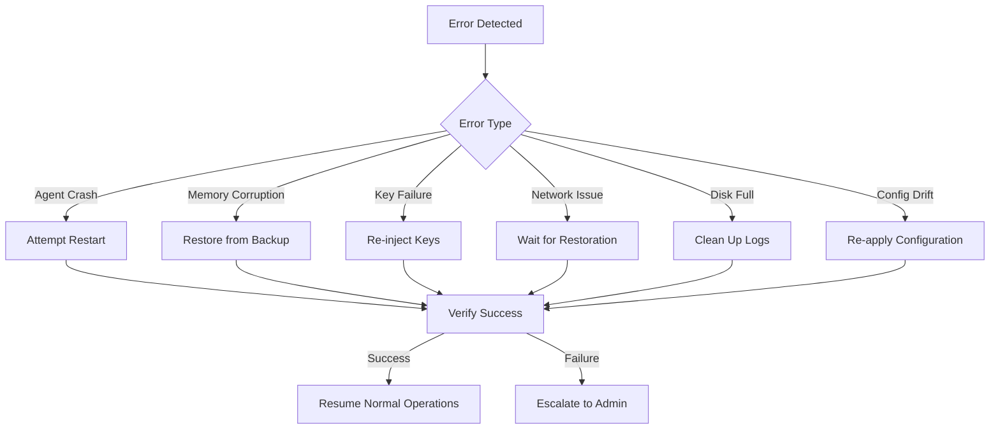

# Hemlock GUI Specification

**Comprehensive UI Requirements for Enterprise-Grade Multi-Agent Operations**

## Overview

This specification defines the UI requirements for monitoring, managing, and interacting with the Hemlock operational system. The GUI must provide enterprise-grade visibility, control, and observability for AI agents, crews, and runtime operations.

## Operational Aspects Requiring UI Representation

### Core Components

| Component          | UI Requirements                                                                 |
|--------------------|---------------------------------------------------------------------------------|
| **Agents**         | Real-time status, lifecycle management, configuration, memory visualization    |
| **Crews**          | Collaboration visualization, session management, interaction monitoring        |
| **Runtime**        | System health, resource usage, configuration management                         |
| **Skills**         | Skill registry, installation, usage analytics                                   |
| **Memory**         | Memory visualization, search, promotion/demotion management                    |
| **Security**       | Key management, access control, audit logging                                   |
| **Monitoring**     | Real-time metrics, alerts, historical analysis                                  |
| **Configuration**  | System-wide settings, environment management, key injection                     |

## Health Check Categories & Status Indicators

### Health Status Levels

| Level   | Color   | Icon       | Description                          |
|---------|---------|------------|--------------------------------------|
| OK      | Green   | ✓          | All checks passed                    |
| Warning | Yellow  | ⚠          | Non-critical issues detected         |
| Critical| Red     | ✗          | Critical failure requiring attention |
| Unknown | Gray    | ?          | Status cannot be determined          |

### Health Check Dashboard



**Required Views**:
- **Summary View**: High-level status of all categories
- **Detailed View**: Per-category breakdown with remediation steps
- **Historical View**: Trend analysis and anomaly detection
- **Alert View**: Active alerts with severity and timestamp

## Key Injection Workflow

### UI Flow



### UI Requirements

- **Source Selection**: Dropdown for OpenClaw/Manual/File
- **Validation Feedback**: Real-time validation of key formats
- **Preview Pane**: Side-by-side comparison of current/new values
- **Confirmation Dialog**: Explicit confirmation before writing secrets
- **Success Verification**: Post-injection verification results
- **Error Handling**: Clear error messages with recovery options

## Runtime Monitoring

### Real-Time Monitoring Requirements

| Metric               | Visualization Type          | Update Frequency |
|----------------------|-----------------------------|------------------|
| Agent Status         | Status grid                 | 5s               |
| CPU Usage            | Gauge/Line chart            | 10s              |
| Memory Usage         | Gauge/Line chart            | 10s              |
| Disk Usage           | Gauge/Line chart            | 30s              |
| Network Throughput   | Line chart                  | 10s              |
| Token Usage          | Counter/Line chart          | 30s              |
| Response Times       | Histogram                   | 30s              |
| Error Rates          | Counter/Line chart          | 30s              |

### Agent Monitoring View

- **Status Panel**: Real-time agent state (running, stopped, error)
- **Memory Visualization**: Short-term/long-term memory breakdown
- **Skill Usage**: Active skills and execution frequency
- **Interaction Log**: Recent agent interactions and commands
- **Configuration**: Current agent configuration and overrides
- **Performance**: Token usage, response times, success rates

## Agent Lifecycle Management

### UI Components

| Lifecycle Stage      | UI Requirements                                                                 |
|----------------------|---------------------------------------------------------------------------------|
| **Creation**         | Agent template selection, configuration wizard, validation feedback            |
| **Configuration**    | Environment variable editor, model selection, skill assignment                 |
| **Start/Stop**       | Graceful start/stop controls, force kill option                                |
| **Monitoring**       | Real-time logs, memory visualization, performance metrics                      |
| **Export/Import**    | Package selection, export format options, import validation                    |
| **Deletion**         | Safe deletion workflow with backup option                                      |

### Agent Grid View

- **Search & Filter**: By status, model, skills, last activity
- **Bulk Actions**: Start/stop/restart multiple agents
- **Quick Actions**: One-click access to common operations
- **Status Indicators**: Color-coded agent status
- **Performance Badges**: Highlight high-performing/struggling agents

## Configuration Management

### Configuration Editor

- **YAML Editor**: Syntax highlighting, validation, auto-completion
- **Environment Variables**: Secure editor for `.env` files
- **Key Management**: Secure interface for secret injection
- **Validation**: Real-time configuration validation
- **Diff View**: Side-by-side comparison of changes
- **History**: Version history and rollback capability

## Secret Management

### Security Dashboard

- **Key Inventory**: List of all injected keys with metadata
- **Key Rotation**: One-click key rotation workflow
- **Access Control**: Permission management for keys
- **Audit Log**: History of key access and modifications
- **Expiration Tracking**: Expiration dates and renewal reminders
- **Usage Analytics**: Key usage patterns and access frequency

## Docker Integration

### Container Management

- **Container Grid**: Status of all Hemlock containers
- **Resource Usage**: CPU, memory, disk per container
- **Logs**: Real-time log streaming
- **Shell Access**: Secure shell access to containers
- **Network**: Visualization of container networking
- **Volumes**: Mounted volume management

## OpenClaw Integration Points

### Integration Dashboard

- **Gateway Status**: Connection status and latency
- **Configuration Sync**: OpenClaw configuration status
- **Key Sync**: Key injection status and last sync time
- **Health Sync**: Integrated health check status
- **Event Log**: OpenClaw-Hemlock interaction log

## Error States & Recovery Flows

### Error Recovery Workflows



### Error Dashboard Requirements

- **Alert List**: Active alerts with severity and timestamp
- **Error Details**: Detailed error information and context
- **Recovery Options**: One-click recovery workflows
- **Escalation Path**: Clear escalation procedures
- **Historical Analysis**: Error patterns and trends

## Real-Time Monitoring Requirements

### Dashboard Components

| Component           | Visualization Type          | Data Source               |
|---------------------|-----------------------------|---------------------------|
| **Agent Status**    | Status grid                 | Health checks             |
| **Crew Collaboration**| Network graph              | Interaction logs          |
| **Resource Usage**  | Gauges/Line charts          | System metrics            |
| **Token Usage**     | Counter/Line chart          | Inference logs            |
| **Response Times**  | Histogram                   | Performance metrics       |
| **Error Rates**     | Counter/Line chart          | Error logs                |
| **Key Status**      | Status indicators           | Secret validation         |
| **Configuration**   | Version diff                | Config validation         |

## Dashboard Layout Recommendations

### Primary Dashboard (Overview)

```
-----------------------------------------
| HEMLOCK OPERATIONAL DASHBOARD          |
-----------------------------------------
| [Header: System Status | Time | Alerts] |
-----------------------------------------
|                                            |
|  [Agent Status Grid]  [Crew Network]     |
|                                            |
|  [Resource Usage]     [Token Usage]       |
|                                            |
|  [Recent Alerts]      [Quick Actions]     |
|                                            |
-----------------------------------------
| [Footer: Version | Support | Docs]      |
-----------------------------------------
```

### Agent Dashboard

```
-----------------------------------------
| AGENT: <agent_id>                     |
-----------------------------------------
| [Status] [Performance] [Memory]        |
-----------------------------------------
|                                            |
|  [Memory Visualization]                 |
|                                            |
|  [Skill Usage]      [Interaction Log]    |
|                                            |
|  [Configuration]    [Actions]            |
|                                            |
-----------------------------------------
```

### Crew Dashboard

```
-----------------------------------------
| CREW: <crew_name>                     |
-----------------------------------------
| [Status] [Collaboration Graph]         |
-----------------------------------------
|                                            |
|  [Agent Status Grid]                    |
|                                            |
|  [Interaction Timeline] [Message Flow]  |
|                                            |
|  [Performance]     [Actions]            |
|                                            |
-----------------------------------------
```

## Technical Requirements

### Frontend Architecture

- **Framework**: React 18+ with TypeScript
- **State Management**: Redux Toolkit or Zustand
- **UI Components**: Material-UI or Ant Design
- **Charts**: D3.js or Chart.js
- **Real-Time Updates**: WebSockets or Server-Sent Events
- **Responsive Design**: Mobile-first, adaptive layouts

### Backend Integration

- **API Endpoints**: RESTful API for management operations
- **Real-Time Data**: WebSocket endpoints for live updates
- **Authentication**: JWT-based authentication
- **Authorization**: Role-based access control
- **Data Sources**:
  - Health checks (`/api/health`)
  - Agent status (`/api/agents`)
  - Crew interactions (`/api/crews`)
  - System metrics (`/api/metrics`)
  - Logs (`/api/logs`)

### Security Requirements

- **Authentication**: Multi-factor authentication support
- **Authorization**: Fine-grained access control
- **Audit Logging**: All UI actions logged
- **Data Protection**: Encryption of sensitive data in transit and at rest
- **Session Management**: Secure session handling with timeout

## Implementation Priorities

1. **Health Dashboard**: Real-time system health monitoring
2. **Agent Grid**: Comprehensive agent management
3. **Crew Visualization**: Collaboration monitoring
4. **Configuration Editor**: System configuration management
5. **Key Management**: Secure secret handling
6. **Error Recovery**: Automated recovery workflows
7. **Performance Monitoring**: Resource and token usage tracking
8. **Audit Logs**: Comprehensive activity logging

---

## Phase 30: Operational Health & Integration - GUI Extensions

### Health Check Dashboard (Menu Option 30)

#### UI Components

| View Type | Description | Data Source |
|-----------|-------------|-------------|
| **Quick Health** | Fast path/env/imports check (5s) | `health.doctor_bridge --quick` |
| **Full Health** | Comprehensive 85-point validation | `health.doctor_bridge` |
| **Auto-Fix** | One-click remediation | `health.doctor_bridge --fix` |
| **JSON Report** | Machine-readable status | `health.doctor_bridge --json` |

#### Health Check Visualization

```
-----------------------------------------
| SYSTEM HEALTH DASHBOARD                |
-----------------------------------------
| Status: HEALTHY ✓ | 41 ok | 14 warn | 0 fail |
| Duration: 2.3s | Last Check: 2026-05-14 11:45 |
-----------------------------------------
|                                            |
|  [PATHS]        [ENV]          [IMPORTS]  |
|   ✓ 24 checks   ✓ 24 checks    ✓ 2 checks |
|                                            |
|  [ADAPTERS]     [ORCHESTRATION] [PERSISTENCE] |
|   ✓ 8 checks    ✓ 4 checks      ✓ 2 checks |
|                                            |
|  [IDENTITY]     [GATEWAY]       [RUNTIME]  |
|   ✓ 3 checks    ✓ 5 checks      ✓ 2 checks |
|                                            |
-----------------------------------------
| [Run Quick] [Run Full] [Auto-Fix] [Export JSON] |
-----------------------------------------
```

#### Health Category Drill-Down

```
-----------------------------------------
| PATHS - 24 checks (20 ok, 4 warn)      |
-----------------------------------------
| ✓ paths_import      PathResolver OK    |
| ✓ path_root         /opt/hermes        |
| ✓ path_hermes_home  ~/.hermes          |
| ⚠ path_agents_dir  /agents (missing)   |
| ⚠ path_crews_dir   /crews (missing)    |
| ⚠ path_skills_root /skills (missing)   |
| ⚠ path_logs_dir    /var/log (missing)  |
| ✓ write_hermes_home Writable           |
| ✓ docker_detection Docker available    |
| ... (15 more checks)                   |
|                                            |
| [Auto-Fix Missing Dirs] [Refresh]        |
-----------------------------------------
```

### Key Injection Dashboard (Menu Option 31)

#### UI Workflow

```
┌─────────────────────────────────────────┐
│  KEY INJECTION WORKFLOW                 │
├─────────────────────────────────────────┤
│  1. Source Selection                    │
│     ○ OpenClaw Config (~/.openclaw/)   │
│     ○ JSON File Upload                  │
│     ○ Manual Entry                      │
│                                         │
│  2. Validation                          │
│     ✓ OpenRouter API Key (sk-or-...)   │
│     ✓ Anthropic API Key (sk-ant-...)   │
│     ✓ Telegram Bot Token (missing)     │
│     ✓ Discord Bot Token (missing)      │
│                                         │
│  3. Preview Changes                     │
│     Current: 0 keys injected            │
│     New: 4 keys will be injected        │
│                                         │
│  4. Confirmation                        │
│     [ ] I understand this will write    │
│         secrets to ~/.hermes/.secrets/  │
│                                         │
│     [Cancel] [Inject Keys]              │
└─────────────────────────────────────────┘
```

#### Key Status Panel

| Key Type | Status | Last Updated | Source |
|----------|--------|--------------|--------|
| OpenRouter API | ✓ Injected | 2026-05-14 11:30 | OpenClaw |
| Anthropic API | ✓ Injected | 2026-05-14 11:30 | OpenClaw |
| Telegram Bot | ⚠ Missing | - | - |
| Discord Bot | ⚠ Missing | - | - |
| GitHub Token | ⚠ Missing | - | - |

#### Security Features

- **Masked Display**: Keys shown as `sk-or-v1************abcd`
- **Audit Log**: All injection attempts logged with timestamp
- **Rotation Support**: One-click key rotation workflow
- **Expiration Alerts**: Notifications for expiring keys
- **Access Control**: Role-based key management permissions

### Runtime Management Dashboard (Menu Option 32)

#### Runtime Status Panel

```
-----------------------------------------
| RUNTIME DAEMON STATUS                 |
-----------------------------------------
| Status: ● Running | PID: 12345        |
| Uptime: 3d 14h 22m | CPU: 2.3%        |
| Memory: 512MB / 2GB | Threads: 8      |
-----------------------------------------
|                                            |
|  [Start] [Stop] [Restart] [Logs]         |
|                                            |
|  Recent Activity:                         |
|  ✓ 11:45 - Health check passed           |
|  ✓ 11:30 - Key injection completed       |
|  ✓ 11:00 - Agent hermes started          |
|  ⚠ 10:45 - High memory usage (85%)       |
|  ✓ 10:00 - Daily backup completed        |
|                                            |
-----------------------------------------
| [Setup] [Configure] [Advanced]           |
-----------------------------------------
```

#### Runtime Modes

| Mode | Description | Use Case |
|------|-------------|----------|
| **Docker** | Containerized runtime | Production deployment |
| **Native** | Direct Python execution | Development/testing |
| **Hybrid** | Docker with native tools | Mixed environments |

### System Doctor Dashboard (Menu Option 33)

#### Doctor Interface

```
-----------------------------------------
| SYSTEM DOCTOR DIAGNOSTICS             |
-----------------------------------------
|                                            |
|  Scan Type:                               |
|  ○ Quick Scan (30s) - Basic checks       |
|  ● Full Scan (5min) - Comprehensive      |
|  ○ Deep Scan (15min) - With remediation  |
|                                            |
|  Categories:                              |
|  [✓] Paths      [✓] Environment          |
|  [✓] Identity   [✓] Gateway               |
|  [✓] Imports    [✓] Adapters              |
|  [✓] Orchestration [✓] Persistence       |
|  [✓] Agents     [✓] Crews                 |
|  [✓] Resources  [✓] Security              |
|                                            |
|  Options:                                 |
|  [✓] Auto-fix issues                     |
|  [ ] Generate report                     |
|  [ ] Backup before fixes                 |
|                                            |
|  [Run Diagnostics] [Export Report]        |
-----------------------------------------
```

#### Doctor Results View

```
-----------------------------------------
| DIAGNOSTICS RESULTS - 8 issues found  |
-----------------------------------------
| CRITICAL (2)                           |
| ✗ Agent hermes not responding         |
|   → [Restart Agent] [View Logs]        |
| ✗ Database connection failed          |
|   → [Reconnect] [Check Config]         |
|                                            |
| WARNINGS (6)                           |
| ⚠ Disk usage > 80% (85%)              |
|   → [Clean Logs] [Expand Storage]      |
| ⚠ Memory usage high (78%)             |
|   → [Restart Runtime] [Add RAM]        |
| ⚠ 3 skills outdated                   |
|   → [Update Skills] [Defer]            |
| ⚠ Backup older than 7 days            |
|   → [Run Backup] [Schedule]            |
| ⚠ SSL cert expires in 14 days         |
|   → [Renew Certificate]                |
| ⚠ API rate limit approaching          |
|   → [Review Usage] [Upgrade Plan]      |
|                                            |
| [Dismiss All] [Export Report]           |
-----------------------------------------
```

### Docker Runtime Dashboard (Menu Option 34)

#### Container Management View

```
-----------------------------------------
| DOCKER RUNTIME OPERATIONS             |
-----------------------------------------
|                                            |
|  Containers:                              |
|  ┌────────────────────────────────────┐  |
|  │ hemlock-runtime   ● Running  3d   │  |
|  │ hemlock-agent     ● Running  3d   │  |
|  │ hemlock-doctor    ○ Stopped       │  |
|  │ hemlock-setup     ○ Stopped       │  |
|  └────────────────────────────────────┘  |
|                                            |
|  Resource Usage:                          |
|  CPU: ████████░░ 45% | Memory: 2.1GB/4GB |
|  Disk: ██████████░░ 25GB/32GB            |
|                                            |
|  Quick Actions:                           |
|  [Start All] [Stop All] [Restart All]    |
|  [Run Doctor] [Run Setup] [View Logs]    |
|                                            |
|  Service Health:                          |
|  ✓ Runtime: HEALTHY (HTTP 200)           |
|  ✓ Agent: HEALTHY (HTTP 200)             |
|  ⚠ Doctor: UNHEALTHY (exit code 1)       |
|  ✓ Setup: HEALTHY (ready)                |
|                                            |
-----------------------------------------
| [Build Image] [Advanced] [Network]       |
-----------------------------------------
```

#### Docker Operations Matrix

| Operation | Command | UI Action |
|-----------|---------|-----------|
| Start Services | `docker compose up -d` | [Start All] |
| Stop Services | `docker compose down` | [Stop All] |
| Restart | `docker compose restart` | [Restart All] |
| Doctor Service | `docker compose run doctor` | [Run Doctor] |
| Setup Service | `docker compose run setup` | [Run Setup] |
| View Logs | `docker compose logs -f` | [View Logs] |
| Build Image | `docker build -t hemlock:latest` | [Build Image] |

---

## API Endpoints for Phase 30 Features

### Health Check API

```yaml
GET /api/health/quick:
  description: Quick health check (paths, env, imports)
  response: { healthy: bool, checks: [], duration_ms: number }

GET /api/health/full:
  description: Full 85-point health validation
  response: { healthy: bool, results: [CheckResult], summary: {} }

POST /api/health/fix:
  description: Auto-fix identified issues
  body: { categories: [], force: bool }
  response: { fixed: [], failed: [], skipped: [] }

GET /api/health/report:
  description: Generate JSON health report
  query: { format: 'json' | 'yaml' | 'html' }
```

### Key Injection API

```yaml
GET /api/keys/status:
  description: Current key injection status
  response: { injected: [], missing: [], expired: [] }

POST /api/keys/inject:
  description: Inject keys from source
  body: { source: 'openclaw' | 'file' | 'manual', config: {} }
  response: { injected: number, skipped: number, errors: [] }

POST /api/keys/verify:
  description: Verify injected keys
  response: { valid: [], invalid: [], missing: [] }

DELETE /api/keys/{key_name}:
  description: Remove specific key
  response: { success: bool, message: string }
```

### Runtime Management API

```yaml
GET /api/runtime/status:
  description: Runtime daemon status
  response: { running: bool, pid: number, uptime: string, resources: {} }

POST /api/runtime/start:
  description: Start runtime daemon
  body: { mode: 'docker' | 'native' }

POST /api/runtime/stop:
  description: Stop runtime daemon
  body: { graceful: bool, timeout: number }

GET /api/runtime/logs:
  description: Stream runtime logs
  query: { lines: number, follow: bool }
```

### Doctor API

```yaml
POST /api/doctor/scan:
  description: Run doctor diagnostics
  body: { mode: 'quick' | 'full' | 'deep', categories: [], auto_fix: bool }

GET /api/doctor/results:
  description: Get latest scan results
  response: { issues: [], fixed: [], recommendations: [] }

POST /api/doctor/fix/{issue_id}:
  description: Fix specific issue
  response: { success: bool, message: string }
```

### Docker Operations API

```yaml
GET /api/docker/containers:
  description: List all containers
  response: { containers: [ContainerInfo] }

POST /api/docker/action:
  description: Perform container action
  body: { action: 'start' | 'stop' | 'restart', containers: [] }

GET /api/docker/logs:
  description: Stream container logs
  query: { container: string, follow: bool, tail: number }

POST /api/docker/build:
  description: Build Docker image
  body: { tag: string, dockerfile: string, context: string }
```

---

## Integration Verification Checklist

### Menu Accessibility
- [ ] Option 30: Health check - accessible and functional
- [ ] Option 31: Key injection - accessible and functional
- [ ] Option 32: Runtime management - accessible and functional
- [ ] Option 33: System doctor - accessible and functional
- [ ] Option 34: Docker runtime - accessible and functional

### Backend Integration
- [ ] `health.doctor_bridge` - all modes working
- [ ] `scripts.key_inject` - all sources working
- [ ] `runtime.init` - Docker and native modes working
- [ ] `docker.hermes_agent.runtime.cli` - doctor commands working
- [ ] Docker Compose - all services defined and operational

### Frontend Requirements
- [ ] Health dashboard with real-time updates
- [ ] Key injection wizard with validation
- [ ] Runtime status panel with controls
- [ ] Doctor diagnostics interface
- [ ] Docker container management view
- [ ] WebSocket integration for live data
- [ ] Audit logging for all operations
- [ ] Role-based access control

### Security Requirements
- [ ] Secrets never displayed in plain text
- [ ] All operations logged with user context
- [ ] Confirmation dialogs for destructive actions
- [ ] Session timeout and re-authentication
- [ ] API rate limiting and throttling
- [ ] Input validation and sanitization
- [ ] CSRF protection for all mutations
- [ ] HTTPS enforcement for all connections

### Performance Requirements
- [ ] Health check < 5s for quick mode
- [ ] Health check < 60s for full mode
- [ ] Key injection < 10s
- [ ] Runtime status update < 1s
- [ ] Log streaming latency < 500ms
- [ ] Dashboard load time < 2s
- [ ] API response time < 200ms (p95)
- [ ] WebSocket reconnection < 5s

---

## Appendix: Phase 30 Command Reference

### CLI Commands

```bash
# Health Checks
./runtime.sh health-check --quick
./runtime.sh health-check --full
./runtime.sh health-check --fix
./runtime.sh health-check --json

# Key Injection
./runtime.sh key-inject --from-openclaw
./runtime.sh key-inject --from-file config.json
./runtime.sh key-inject --dry-run
./runtime.sh key-inject --verify

# Runtime Management
./runtime.sh runtime-start [--docker|--native]
./runtime.sh runtime-stop [--graceful]
./runtime.sh runtime-status
./runtime.sh runtime-logs [--follow]

# System Doctor
./runtime.sh doctor [--quick|--full|--deep]
./runtime.sh doctor --fix
./runtime.sh doctor --json

# Docker Operations
./runtime.sh docker-up
./runtime.sh docker-down
./runtime.sh docker-restart
./runtime.sh docker-doctor
./runtime.sh docker-setup
./runtime.sh docker-build
```

### Python Module Access

```python
# Health Checks
from health.doctor_bridge import run_health_checks
result = run_health_checks(mode='quick', fix=False, json_output=True)

# Key Injection
from scripts.key_inject import inject_keys
result = inject_keys(source='openclaw', dry_run=False, verify=True)

# Runtime Management
from docker.hermes_agent.runtime.init import main
main(['--setup', '--doctor', '--json'])

# Doctor Diagnostics
from docker.hermes_agent.runtime.cli import doctor
result = doctor(mode='full', auto_fix=True, json_output=False)
```