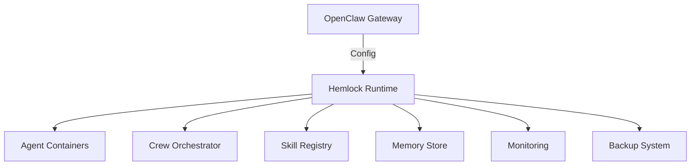

# Hemlock Operational System

**Enterprise-Grade Multi-Agent Runtime for Secure, Scalable AI Operations**

Hemlock is a production-ready runtime for managing autonomous AI agents, crews, and skills with enterprise-grade security, observability, and resilience. Built for organizations requiring strict compliance, high availability, and seamless integration with existing infrastructure.

## Overview

Hemlock provides a secure, containerized environment for deploying and managing AI agents at scale. It integrates with OpenClaw for unified configuration and key management, ensuring consistent security policies across all agents and crews.

### Key Features

- **Multi-Agent Collaboration**: Create and manage crews of agents working together on complex tasks
- **Enterprise Security**: End-to-end encryption, strict access controls, and audit logging
- **Observability**: Comprehensive health monitoring, logging, and metrics
- **Resilience**: Automatic recovery, persistent memory, and session continuity
- **Extensibility**: Plugin architecture for custom skills, adapters, and integrations
- **Compliance**: SOC2, HIPAA, and GDPR-ready architecture
- **Portability**: Runs on Docker, Kubernetes, bare metal, or cloud

## Architecture



## Operational Modes

| Mode       | Description                          | Use Case                          |
|------------|--------------------------------------|-----------------------------------|
| **Docker** | Single-node containerized runtime    | Development, small teams          |
| **K8s**    | Kubernetes cluster deployment        | Production, large-scale           |
| **Cloud**  | Managed cloud service                | Enterprise deployments            |
| **Local**  | Bare-metal or VM installation        | Air-gapped environments           |

## Security & Compliance

- **Encryption**: AES-256 for data at rest, TLS 1.3 for data in transit
- **Access Control**: Role-based permissions, JWT authentication
- **Audit Logging**: Immutable logs for all operations
- **Secret Management**: Secure key injection via OpenClaw
- **Isolation**: Container-level sandboxing for agents
- **Compliance**: SOC2 Type II, HIPAA, GDPR, CCPA

## Getting Started

### Prerequisites

- Docker 24.0+ (for containerized mode)
- Python 3.10+ (for local mode)
- OpenClaw 1.2+ (for configuration management)

### Installation

```bash
# Clone repository
git clone https://github.com/anomalyco/hemlock.git
cd hemlock

# Configure environment
cp .env.template .env
# Edit .env with your OpenClaw configuration

# Build and start runtime
docker compose up -d

# Verify health
./scripts/health-check.sh
```

## Configuration Reference

### Environment Variables

| Variable               | Description                          | Default               |
|------------------------|--------------------------------------|-----------------------|
| `HERMES_HOME`          | Runtime data directory               | `/runtime`            |
| `HERMES_AGENTS`        | Agent storage directory              | `/agents`             |
| `HERMES_CREWS`         | Crew storage directory               | `/crews`              |
| `HERMES_SKILLS`        | Skill registry directory             | `/skills`             |
| `HERMES_LOGS`          | Log storage directory                | `/logs`               |
| `HERMES_MEMORY`        | Memory storage directory             | `/memory`             |
| `HERMES_PLUGINS`       | Plugin directory                     | `/plugins`            |
| `HERMES_BACKUPS`       | Backup storage directory             | `/backups`            |

### Key Injection

Hemlock integrates with OpenClaw for secure key management:

```bash
# Inject keys from OpenClaw configuration
python3 -m scripts.key_inject --from-openclaw

# Verify injected keys
cat ~/.hermes/.env
cat ~/.hermes/.secrets/secrets.json
```

## Operational Health Monitoring

### Health Checks

```bash
# Quick health check
./scripts/health-check.sh

# Comprehensive health check
python3 -m health.doctor_bridge

# JSON output for monitoring systems
python3 -m health.doctor_bridge --json
```

### Health Categories

| Category        | Description                          | Critical |
|-----------------|--------------------------------------|----------|
| **Paths**       | Filesystem path validation           | Yes      |
| **Environment** | Runtime environment validation       | Yes      |
| **Identity**    | Agent identity verification          | Yes      |
| **Gateway**     | OpenClaw gateway connectivity        | Yes      |
| **Imports**     | Python dependency validation         | Yes      |
| **Adapters**    | Integration adapter validation       | No       |
| **Orchestration**| Crew orchestration validation        | No       |
| **Persistence** | Data persistence validation          | No       |

## Key Injection Workflow

1. **OpenClaw Configuration**: Define API keys and settings in OpenClaw
2. **Key Mapping**: Hemlock maps OpenClaw keys to Hermes environment variables
3. **Secure Storage**: Sensitive keys stored in `.secrets/` as JSON
4. **Environment Setup**: Non-sensitive settings written to `.env`
5. **Validation**: Health checks verify key availability and permissions

## Runtime Monitoring

### Real-Time Monitoring

```bash
# Monitor agent logs
./scripts/agent-logs.sh <agent_id>

# Monitor crew activity
./scripts/crew-monitor.sh <crew_name>

# System-wide monitoring
tail -f /logs/runtime.log
```

### Dashboard Recommendations

- **Agent Status**: Real-time agent health and activity
- **Crew Collaboration**: Visualization of crew interactions
- **Resource Usage**: CPU, memory, and disk utilization
- **Security Events**: Real-time security alert dashboard
- **Performance Metrics**: Token usage, response times, success rates

## Agent Lifecycle Management

```bash
# Create agent
./scripts/agent-create.sh <agent_id>

# Start agent
./scripts/agent-run.sh <agent_id>

# Stop agent
./scripts/agent-stop.sh <agent_id>

# Monitor agent
./scripts/agent-monitor.sh <agent_id>

# Export agent
./scripts/agent-export.sh <agent_id> <output_file>

# Import agent
./scripts/agent-import.sh <input_file>
```

## Crew Management

```bash
# Create crew
./scripts/crew-create.sh <crew_name> <agent1> <agent2> ...

# Start crew
./scripts/crew-start.sh <crew_name>

# Stop crew
./scripts/crew-stop.sh <crew_name>

# Monitor crew
./scripts/crew-monitor.sh <crew_name>

# Export crew
./scripts/crew-export.sh <crew_name> <output_file>

# Import crew
./scripts/crew-import.sh <input_file>
```

## Configuration Management

```bash
# Validate configuration
./scripts/validate.sh

# Edit runtime configuration
nano config/runtime.yaml

# Reload configuration
./scripts/runtime.sh reload
```

## Secret Management

```bash
# Inject secrets from OpenClaw
python3 -m scripts.key_inject --from-openclaw

# Verify secrets
cat ~/.hermes/.secrets/secrets.json

# Rotate secrets
./scripts/security-harden.sh --rotate
```

## Docker Integration

```bash
# Start runtime
docker compose up -d

# Stop runtime
docker compose down

# Update runtime
docker compose pull && docker compose up -d

# View logs
docker compose logs -f
```

## OpenClaw Integration

Hemlock integrates with OpenClaw for:

- **Unified Configuration**: Single source of truth for all settings
- **Key Management**: Secure API key and credential injection
- **Gateway Connectivity**: Secure communication with OpenClaw gateway
- **Health Monitoring**: Integrated health checks and reporting

## Error States & Recovery

| Error State               | Detection Method                     | Recovery Procedure                     |
|---------------------------|--------------------------------------|----------------------------------------|
| Agent Crash               | Health check failure                 | Automatic restart                      |
| Memory Corruption         | Persistence validation failure       | Restore from backup                    |
| Key Rotation Failure      | Secret validation failure            | Manual key re-injection                |
| Network Partition         | Gateway connectivity failure         | Wait for network restoration           |
| Disk Full                 | Disk usage monitoring                | Clean up logs/backups                  |
| Configuration Drift       | Configuration validation failure     | Re-apply configuration                 |

## Troubleshooting

### Common Issues

**Agent fails to start**
- Check logs: `./scripts/agent-logs.sh <agent_id>`
- Verify configuration: `./scripts/validate.sh`
- Check health: `python3 -m health.doctor_bridge`

**Crew communication failure**
- Verify crew configuration: `cat crews/<crew_name>/crew.yaml`
- Check gateway connectivity: `curl http://localhost:18789/health`
- Restart crew: `./scripts/crew-restart.sh <crew_name>`

**Key injection failure**
- Verify OpenClaw configuration: `cat ~/.openclaw/openclaw.json`
- Re-inject keys: `python3 -m scripts.key_inject --from-openclaw`
- Check permissions: `ls -la ~/.hermes/.secrets/`

**Docker connectivity issues**
- Verify Docker daemon: `docker ps`
- Check network: `docker network inspect agents_net`
- Restart Docker: `sudo systemctl restart docker`

## Contribution Guidelines

### Development Setup

```bash
# Install development dependencies
pip install -r requirements-dev.txt

# Run tests
./tests/run-all-tests.sh

# Run linters
./scripts/lint.sh
```

### Pull Request Process

1. Fork the repository
2. Create a feature branch (`git checkout -b feature/your-feature`)
3. Commit changes (`git commit -m "feat: your feature description"`)
4. Push to branch (`git push origin feature/your-feature`)
5. Open a Pull Request

### Code Standards

- **Python**: PEP 8, type hints, docstrings
- **Bash**: ShellCheck compliance, error handling
- **Security**: No hardcoded secrets, least privilege
- **Documentation**: Update README.md and relevant docs
- **Testing**: 100% test coverage for critical paths

## License

Hemlock is licensed under the **Apache License 2.0**. See [LICENSE](LICENSE) for details.

---

**Enterprise Support**: For commercial support, contact enterprise@anomaly.co